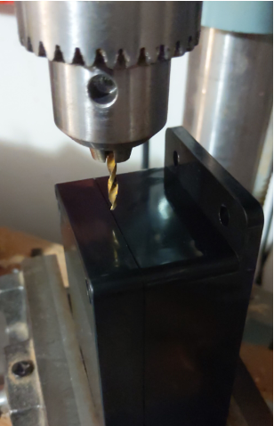
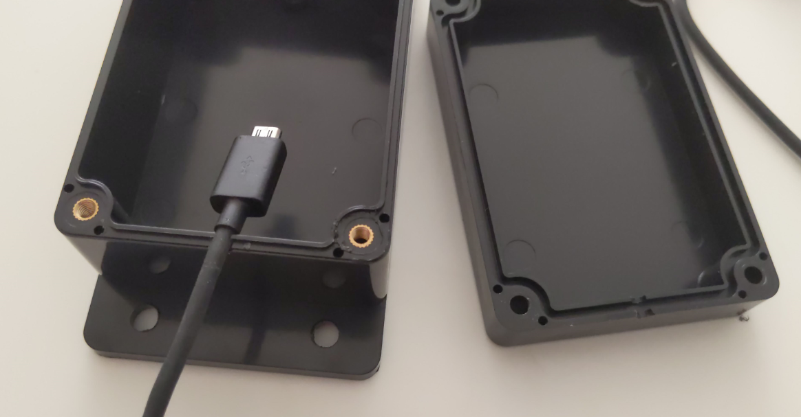
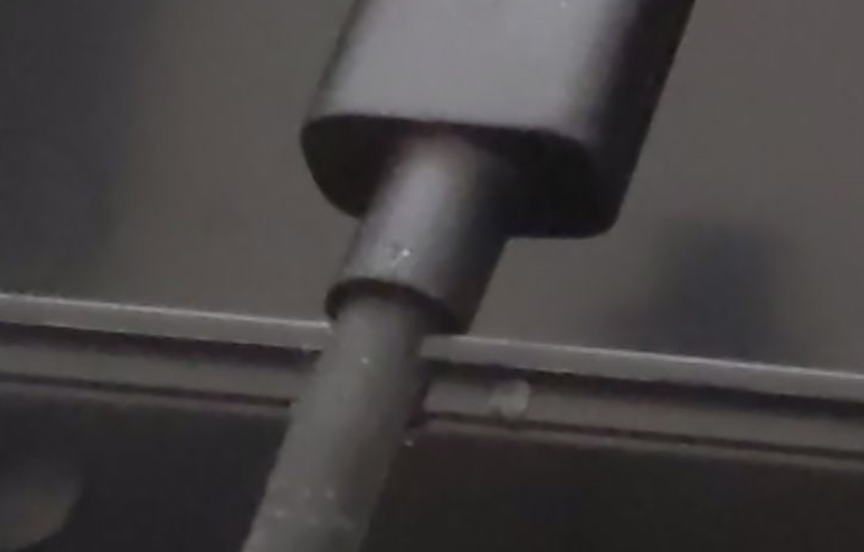
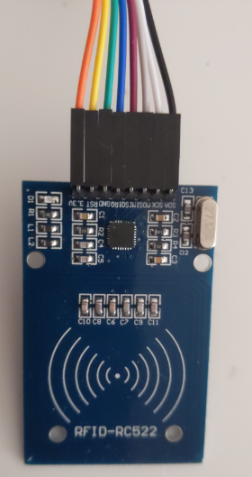
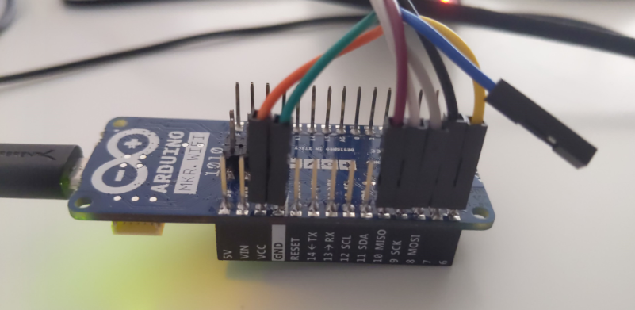
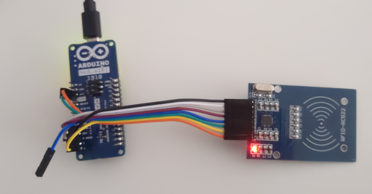
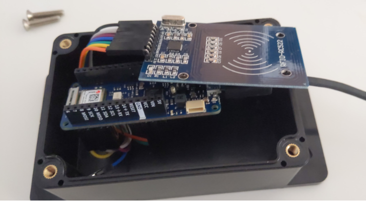
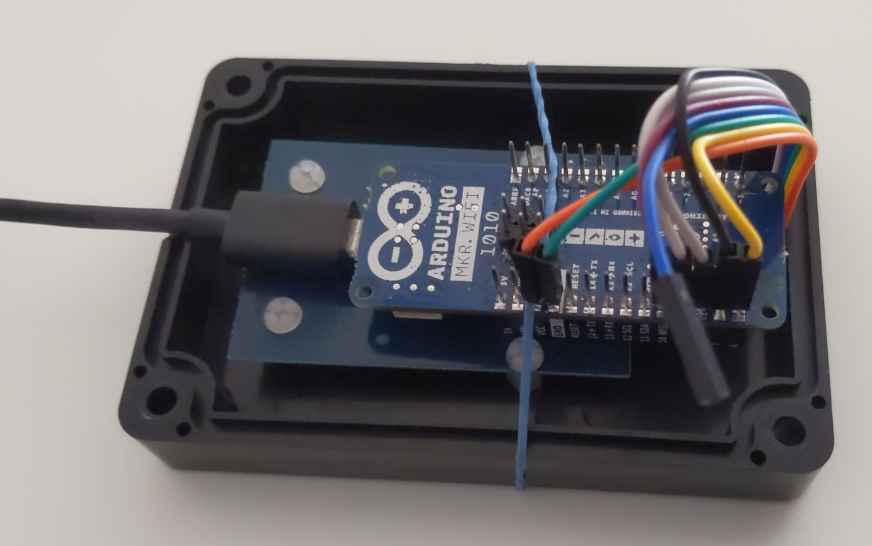
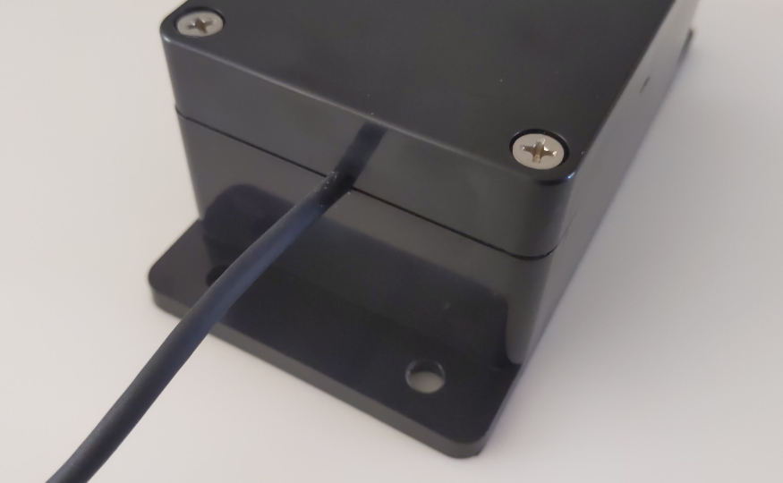

# RFID Logger Enclosure

This project is extremely easy to house in an enclosure. There are no buttons, no moving parts, no display!

Often the hard part for the DIY maker is getting USB power to to board inside the enclosure. One method
is to perfectly mount the board near the perimeter of the box. Then, use a drill or dremmel tool to cut
a nice, perfectly shaped USB connector hole. Easier said than done.

One possibility is to 3D print an enclosure. Not everyone has access to a 3D printer.

An alternative method is to drill a hole at the seam between the lid and the box. For best results, have the lid
snuggly secured when drilling:



With just-the-right-size bit (typically 1/8") - this will allow the USB housing to be used as a strain relief:



As half of the hol is in the base, and the other it in in lid, cable insertion is quite easy:



USB cables come in different size diameters, to it is best to measure to get a nice tight fit.

For long term durability it is best to get boards without headers already soldered, 
and solder the wires directly to the board. For prototypes, it is usually best to use jumper wires.

Here's a closeup of jumper wires connected to the RFID Reader Board:



Here's a closeup of the other end of the wires, connected to the MKR WiFi 1010 board:



Both boards connected to each other:



Test fit:



Held in place for gluing:



Enclosure lid in place:



Note that for maximum range, the RFID PCB with the printing should be as close to the swipe surface as possible. 
The side with the printing is the side with the copper traces as an antenna. It will work from either side, but 
might as well do everything possible for the best range.


The Atmel ICE Squid Cable Connections:

```
             USB

         NC -  - 3  (GND)
(SWDCLK)  4 -  - 0  (RST)
(SWDIO)   2 -  - 1  (3v3)

 (as viewed from bottom)
```
See also [SWD Debugging the Arduino MKR-WiFi-1010 with Atmel ICE](https://gojimmypi.blogspot.com/2018/12/swd-debugging-arduino-mkr-wifi-1010.html)